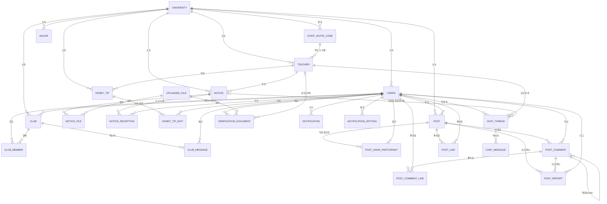

# ERD

Flyway 마이그레이션(`src/main/resources/db/migration/V1~V11`)과 엔티티의 enum 정의를 기준으로 정리한
전체 스키마 문서. 스키마의 소스 오브 트루스는 항상 마이그레이션 파일이다 — 이 문서는 그걸 읽기 좋게
옮긴 것뿐이므로, 새 `V{n}__*.sql`을 추가했다면 이 문서도 같이 갱신할 것.

**공통 규칙**: PK는 전부 `VARCHAR(255)` UUID 문자열(`UuidCreator.create()`)이다. 예외는 `refresh_token`,
`translation_cache` 두 개뿐이고 이 둘만 `BIGSERIAL id`. 대부분의 테이블은 `created_at`/`updated_at`을
갖는다(`BaseTimeEntity` 상속) — 표에서 반복 언급하지 않고, 상속하지 않는 예외만 표시한다.

---

## 1. 전체 관계도

`refresh_token.subject_id`, `translation_cache.content_id`는 대상 테이블이 여러 개(학생/담당자, 공지/
정보글/댓글/채팅 등)라 DB FK로 강제하지 않는 다형성 참조다 — 위 다이어그램에는 표시하지 않았다.
`email_verification`도 계정 생성 전 단계(이메일만 있음)라 FK가 없다.

---

## 2. 도메인별 테이블 상세

### 2.1 university — 대학 (`domain/university`)

| 컬럼 | 타입 | 제약 | 비고 |
| --- | --- | --- | --- |
| id | VARCHAR(255) | PK | |
| name | VARCHAR(100) | NOT NULL | |
| code | VARCHAR(20) | UNIQUE | 예: `INU` |

시드 데이터(V4): `univ-inu` / 인천대학교. `major`도 인천대 학과 10개를 플레이스홀더로 시드(실제 데이터
아님, 교체 필요).

### 2.2 users — 학생 계정 (엔티티명 `Student`, `domain/student`)

테이블명은 `users`지만 담당자는 별도 테이블(`teacher`)이라 실질적으로 "학생 계정" 테이블이다.

| 컬럼 | 타입 | 제약 | 비고 |
| --- | --- | --- | --- |
| id | VARCHAR(255) | PK | |
| university_id | VARCHAR(255) | FK → university | |
| email | VARCHAR(255) | UNIQUE, NOT NULL | |
| login_id | VARCHAR(30) | UNIQUE, NOT NULL (V7) | 로그인은 이메일이 아니라 아이디로. 초기값은 이메일 로컬파트 백필 |
| name | VARCHAR(100) | NOT NULL | |
| password | VARCHAR(255) | NOT NULL | 해시 저장 |
| country | VARCHAR(10) | NOT NULL | |
| language | VARCHAR(10) | NOT NULL | |
| student_type | VARCHAR(30) | NOT NULL | enum `StudentType` — 아래 참고 |
| major | VARCHAR(100) | nullable | 자유 문자열(마스터 데이터 아님). `major` 테이블과 FK 연결 없음 |
| grade | VARCHAR(20) | nullable | |
| birth_year | INTEGER | nullable (V6) | |
| terms_agreed_at / privacy_agreed_at | TIMESTAMP | nullable (V7) | 회원가입 3/3 필수 약관 동의 시각 |
| login_fail_count | INTEGER | DEFAULT 0 (V7) | 5회 실패 시 잠금 |
| locked_until | TIMESTAMP | nullable (V7) | |
| status | VARCHAR(20) | DEFAULT `ACTIVE` (V7) | enum `StudentStatus` |
| withdrawn_at | TIMESTAMP | nullable (V7) | 탈퇴는 소프트 삭제(행 유지) — 커뮤니티 FK 이력 보존 목적 |
| verification_status | VARCHAR(20) | DEFAULT `REGISTERED` (V7) | enum `StudentVerificationStatus` — 이메일/서류 인증 결과 통합 상태 |
| verified_at | TIMESTAMP | nullable (V7) | |

**enum StudentType**: `EXCHANGE_STUDENT`(교환학생), `DEGREE_STUDENT`(정규과정생),
`LANGUAGE_SCHOOL_STUDENT`(어학당 수강생), `KOREAN_STUDENT`(한국인 대학생)
**enum StudentStatus**: `ACTIVE`, `WITHDRAWN`
**enum StudentVerificationStatus**: `REGISTERED` → `DOC_PENDING`/이메일 인증 → `DOC_REJECTED` →
(재제출) → `VERIFIED`

### 2.3 staff_invite_code / teacher — 담당자 온보딩 (`domain/staff`)

Staff는 SSO 없이 **부서별 1회용 초대 코드 + 학교 이메일 인증**으로 가입한다.

**staff_invite_code**

| 컬럼 | 타입 | 제약 |
| --- | --- | --- |
| id | VARCHAR(255) | PK |
| university_id | VARCHAR(255) | FK → university |
| department | VARCHAR(100) | NOT NULL |
| code | VARCHAR(50) | UNIQUE |
| used | BOOLEAN | NOT NULL |
| expires_at | TIMESTAMP | NOT NULL |

**teacher** (엔티티명 `Staff`, 테이블명은 ERD 관례상 `teacher` 유지)

| 컬럼 | 타입 | 제약 | 비고 |
| --- | --- | --- | --- |
| id | VARCHAR(255) | PK | |
| university_id | VARCHAR(255) | FK → university | |
| email | VARCHAR(255) | UNIQUE | |
| name / position / department | VARCHAR(100) | NOT NULL | |
| password | VARCHAR(255) | NOT NULL | |
| verified | BOOLEAN | NOT NULL | 이메일 인증 완료 여부 |
| invite_code_id | VARCHAR(255) | FK → staff_invite_code | |

### 2.4 refresh_token — 인증 (`domain/auth`)

| 컬럼 | 타입 | 제약 | 비고 |
| --- | --- | --- | --- |
| id | BIGSERIAL | PK | 이 테이블 + `translation_cache`만 예외적으로 Long PK |
| subject_id | VARCHAR(255) | NOT NULL | `users.id` 또는 `teacher.id` — FK 아님(role로 구분하는 다형성 참조) |
| role | VARCHAR(20) | NOT NULL | `STUDENT` / `STAFF` (`global.security.Role`) |
| token | VARCHAR(512) | UNIQUE | |
| expires_at | TIMESTAMP | NOT NULL | |

### 2.5 email_verification — 이메일 인증 (`domain/auth`)

| 컬럼 | 타입 | 제약 | 비고 |
| --- | --- | --- | --- |
| id | VARCHAR(255) | PK | |
| email | VARCHAR(255) | NOT NULL | 계정 생성 전 단계라 FK 없음 |
| code | VARCHAR(6) | NOT NULL | |
| purpose | VARCHAR(20) | NOT NULL | enum `EmailVerificationPurpose`: `SIGNUP`, `PASSWORD_RESET` |
| used | BOOLEAN | DEFAULT FALSE | |
| reset_token | VARCHAR(255) | UNIQUE, nullable | |
| attempt_count | INTEGER | DEFAULT 0 (V7) | 6자리 코드 무제한 시도 방지 |
| expires_at | TIMESTAMP | NOT NULL | |

인덱스: `(email, purpose)` 복합 인덱스.

### 2.6 uploaded_file — 파일 (`domain/file`)

| 컬럼 | 타입 | 제약 |
| --- | --- | --- |
| id | VARCHAR(255) | PK |
| filename / content_type / purpose | VARCHAR | NOT NULL |
| file_url | VARCHAR(1024) | NOT NULL |

`FileStorageService` 인터페이스 뒤 스텁(`LocalStubFileStorageService`) — S3 붙일 때 구현체만 교체.
`notice_file`, `verification_document`에서 참조.

### 2.7 notice / notice_file / notice_reception — 공지 (`domain/notice`)

**notice**

| 컬럼 | 타입 | 제약 | 비고 |
| --- | --- | --- | --- |
| id | VARCHAR(255) | PK | |
| university_id | VARCHAR(255) | FK → university | |
| staff_id | VARCHAR(255) | FK → teacher | 작성자 |
| title / content | | NOT NULL | |
| department | VARCHAR(100) | NOT NULL | |
| type | VARCHAR(20) | NOT NULL | enum `NoticeType`: `URGENT`, `NORMAL` |
| total_recipient_count | INTEGER | NOT NULL | |
| banner_start_date / banner_end_date | DATE | nullable (V9) | 홈 상단 배너 노출 기간 |
| status | VARCHAR(20) | DEFAULT `SENT` (V10) | enum `NoticeStatus`: `DRAFT`, `SENT` |
| sent_at | TIMESTAMP | nullable (V10) | 실제 발송 시각(초안 생성 시각과 분리) |
| deleted_at | TIMESTAMP | nullable (V10) | 소프트 삭제 — `chat_thread.notice_id` FK + 학생 열람 이력 보존 때문에 하드 삭제 불가 |
| audience_mode | VARCHAR(20) | nullable (V10) | enum `AudienceMode`: `ALL`, `GROUP`, `INDIVIDUAL` |
| audience_label | VARCHAR(255) | nullable (V10) | 발송 시점 대상 스냅샷 문자열(예: "베트남 유학생, 컴퓨터공학과") |
| resend_count | INTEGER | DEFAULT 0 (V10) | |
| last_resent_at | TIMESTAMP | nullable (V10) | 재발송 쿨다운 판정용 |

**notice_file**: `notice_id` FK → notice, `uploaded_file_id` FK → uploaded_file (첨부 다대다 교차 테이블).

**notice_reception**: `notice_id` FK → notice, `student_id` FK → users, `read` BOOLEAN, `read_at`.
UNIQUE `(notice_id, student_id)`.

### 2.8 club / club_member / club_message — 클럽 (`domain/club`)

**club**

| 컬럼 | 타입 | 제약 |
| --- | --- | --- |
| id | VARCHAR(255) | PK |
| university_id | VARCHAR(255) | FK → university |
| creator_id | VARCHAR(255) | FK → users |
| title / introduction | | NOT NULL |
| max_members / current_members | INTEGER | NOT NULL |
| deadline | DATE | NOT NULL |

**club_member**: `club_id` FK, `student_id` FK, UNIQUE `(club_id, student_id)`. 역할/상태 컬럼 없음 —
방장 여부는 `club.creator_id`로만 판단(`Club.changeCreator()`로 이관).

**club_message**: `club_id` FK, `sender_id` FK → users.

런타임 전용 파생값 `ClubCardState`(`JOINABLE`/`JOINED`/`CLOSED`)는 DB 컬럼이 아니라
`Club.resolveCardState()`가 매 응답마다 계산.

### 2.9 post 계열 — 커뮤니티 (`domain/community`)

**post**

| 컬럼 | 타입 | 제약 | 비고 |
| --- | --- | --- | --- |
| id | VARCHAR(255) | PK | |
| university_id | VARCHAR(255) | FK → university | |
| author_id | VARCHAR(255) | FK → users | |
| title / content | | NOT NULL | |
| original_lang | VARCHAR(10) | NOT NULL | 번역 캐시 조회 키로 사용 |
| like_count / comment_count | INTEGER | NOT NULL | 비정규화 카운트 |
| anonymous | BOOLEAN | DEFAULT TRUE (V9) | 익명/실명 토글 |

**post_anon_participant**: `post_id` FK, `student_id` FK, `anon_number` INTEGER. UNIQUE
`(post_id, student_id)`. ⚠️ `BaseTimeEntity` 미상속 — `created_at`/`updated_at` 없음(엔티티 코드 그대로
반영된 예외).

**post_comment**: `post_id` FK, `author_id` FK → users, `parent_comment_id` FK →
`post_comment.id`(self, 대댓글 1단계용), `original_lang`, `like_count`.

**post_comment_like**: `comment_id` FK, `student_id` FK, UNIQUE `(comment_id, student_id)`.

**post_like**: `post_id` FK, `student_id` FK, UNIQUE `(post_id, student_id)`.

**post_report**: `post_id`/`comment_id` 둘 다 nullable — **애플리케이션 레벨에서 정확히 하나만 채움**
(DB CHECK 제약 없음). `reporter_id` FK → users, `status` enum `ReportStatus`: `PENDING`, `RESOLVED`,
`REJECTED`.

### 2.10 honey_tip / honey_tip_edit — 정보글 (`domain/honeytip`)

**honey_tip**

| 컬럼 | 타입 | 제약 | 비고 |
| --- | --- | --- | --- |
| id | VARCHAR(255) | PK | |
| university_id | VARCHAR(255) | FK → university | |
| staff_id | VARCHAR(255) | FK → teacher | |
| category | VARCHAR(50) | NOT NULL | |
| title / content | | NOT NULL | |
| view_count | INTEGER | NOT NULL | |
| tip_message | VARCHAR(300) | nullable (V9) | 상단 팁 박스 |
| steps_json | TEXT | nullable (V9) | 번호 STEP 리스트를 JSON 문자열로 저장(별도 테이블 없음 — STEP 단위 질의 필요 없어서) |
| estimated_fee / processing_period | VARCHAR(50) | nullable (V9) | |
| external_link | VARCHAR(500) | nullable (V9) | |

**honey_tip_edit**: `honey_tip_id` FK, `requester_id` FK → users, `content` TEXT(수정 제안 본문),
`status` enum `EditRequestStatus`: `PENDING`, `APPROVED`, `REJECTED`, `reviewed_at`.

### 2.11 chat_thread / chat_message — 1:1 문의 채팅 (`domain/chat`)

**chat_thread**

| 컬럼 | 타입 | 제약 | 비고 |
| --- | --- | --- | --- |
| id | VARCHAR(255) | PK | |
| student_id | VARCHAR(255) | FK → users | |
| staff_id | VARCHAR(255) | FK → teacher | |
| notice_id | VARCHAR(255) | FK → notice, nullable | "이 공지 문의하기"로 시작된 스레드의 출처 |
| last_message | VARCHAR(255) | nullable | 목록 미리보기용 비정규화 |
| last_message_at | TIMESTAMP | nullable | |
| student_unread / staff_unread | BOOLEAN | NOT NULL | |
| initiated_by | VARCHAR(20) | DEFAULT `STUDENT` (V11) | enum `ThreadInitiator`: `STUDENT`, `STAFF` — 담당자가 먼저 건 스레드 구분 |

UNIQUE `(student_id, staff_id)` — 학생-담당자 쌍당 스레드 하나.

**chat_message**: `thread_id` FK, `sender_type` enum `SenderType`: `USER`, `TEACHER`, `content` TEXT,
`original_lang` VARCHAR(10) nullable (V11, 학생 원문 언어 기록 → 담당자 조회 시 번역).

> **알려진 갭**: `chat_message`에 `context_type`/`context_id`가 없어서, 공지 외의 다른 딥링크(예: 정보글
> 문의)로 채팅을 여는 기능은 아직 못 만든다. `notice_id`는 `chat_thread`에만 있다.

### 2.12 verification_document — 학생 서류 인증 (`domain/verification`)

| 컬럼 | 타입 | 제약 | 비고 |
| --- | --- | --- | --- |
| id | VARCHAR(255) | PK | |
| student_id | VARCHAR(255) | FK → users | |
| file_id | VARCHAR(255) | FK → uploaded_file | |
| document_type | VARCHAR(30) | NOT NULL (V8) | enum `DocumentType`: `STUDENT_ID`, `ENROLLMENT_CERTIFICATE`, `ADMISSION_LETTER`, `TRANSCRIPT` |
| status | VARCHAR(20) | NOT NULL | enum `VerificationStatus`: `PENDING`, `APPROVED`, `REJECTED` |
| reviewed_by_staff_id | VARCHAR(255) | FK → teacher, nullable | |
| reject_reason | VARCHAR(500) | nullable (V8) | 반려 사유 — 재제출 유도를 위해 서버가 반드시 저장 |
| reviewed_at | TIMESTAMP | nullable | |

### 2.13 translation_cache — 번역 캐시 (`domain/translation`)

| 컬럼 | 타입 | 제약 | 비고 |
| --- | --- | --- | --- |
| id | BIGSERIAL | PK | Long PK 예외 테이블 |
| content_type | VARCHAR(30) | NOT NULL | enum `TranslationContentType`: `POST`, `POST_COMMENT`, `NOTICE`, `HONEY_TIP`, `CHAT_MESSAGE` |
| content_id | VARCHAR(255) | NOT NULL | 다형성 참조(FK 아님) — content_type으로 대상 테이블 구분 |
| target_lang | VARCHAR(10) | NOT NULL | |
| translated_text | TEXT | NOT NULL | |
| model | VARCHAR(50) | NOT NULL | |

UNIQUE `(content_type, content_id, target_lang)`. `TranslationService` 인터페이스 뒤
`StubTranslationService` — NLLB-200 붙일 때 구현체만 교체.

### 2.14 major — 학과 마스터 (`domain/university`)

| 컬럼 | 타입 | 제약 |
| --- | --- | --- |
| id | VARCHAR(255) | PK |
| university_id | VARCHAR(255) | FK → university |
| name | VARCHAR(100) | NOT NULL |

⚠️ `users.major`는 자유 문자열이고 이 테이블과 FK로 연결되어 있지 않다 — 전공 검색 자동완성 등에
쓰일 마스터 데이터 후보로 V4에서 먼저 만들어둔 상태.

### 2.15 notification / notification_setting — 알림 (`domain/notice`? → 실제로는 알림 전용 도메인)

**notification**

| 컬럼 | 타입 | 제약 | 비고 |
| --- | --- | --- | --- |
| id | VARCHAR(255) | PK | |
| student_id | VARCHAR(255) | FK → users | |
| category | VARCHAR(20) | NOT NULL | enum `NotificationCategory`: `CHAT_DIRECT`, `CHAT_CLUB`, `NOTICE`, `COMMUNITY`, `CLUB`, `HONEY_TIP`, `SYSTEM` (각 값에 `required` boolean 필드 — `SYSTEM`만 true, 끌 수 없음) |
| title | VARCHAR(255) | NOT NULL | |
| link_type / link_id | VARCHAR(50)/(255) | nullable | 딥링크 대상(다형성, FK 아님) |
| read / read_at | | | |

**notification_setting**: `student_id` FK, `category` (동일 enum), `enabled` BOOLEAN. UNIQUE
`(student_id, category)` — 카테고리별 on/off.

---

## 3. Enum 요약

| Enum | 위치 | 값 | 대상 컬럼 |
| --- | --- | --- | --- |
| Role | `global/security` | `STUDENT`, `STAFF` | DB 컬럼 아님(JWT/`AuthPrincipal`) — `refresh_token.role`은 이 값을 문자열로 저장 |
| StudentType | `domain/student/entity` | `EXCHANGE_STUDENT`, `DEGREE_STUDENT`, `LANGUAGE_SCHOOL_STUDENT`, `KOREAN_STUDENT` | users.student_type |
| StudentStatus | `domain/student/entity` | `ACTIVE`, `WITHDRAWN` | users.status |
| StudentVerificationStatus | `domain/student/entity` | `REGISTERED`, `DOC_PENDING`, `DOC_REJECTED`, `VERIFIED` | users.verification_status |
| NoticeType | `domain/notice/entity` | `URGENT`, `NORMAL` | notice.type |
| NoticeStatus | `domain/notice/entity` | `DRAFT`, `SENT` | notice.status |
| AudienceMode | `domain/notice/entity` | `ALL`, `GROUP`, `INDIVIDUAL` | notice.audience_mode |
| SenderType | `domain/chat/entity` | `USER`, `TEACHER` | chat_message.sender_type |
| ThreadInitiator | `domain/chat/entity` | `STUDENT`, `STAFF` | chat_thread.initiated_by |
| DocumentType | `domain/verification/entity` | `STUDENT_ID`, `ENROLLMENT_CERTIFICATE`, `ADMISSION_LETTER`, `TRANSCRIPT` | verification_document.document_type |
| VerificationStatus | `domain/verification/entity` | `PENDING`, `APPROVED`, `REJECTED` | verification_document.status |
| ReportStatus | `domain/community/entity` | `PENDING`, `RESOLVED`, `REJECTED` | post_report.status |
| EditRequestStatus | `domain/honeytip/entity` | `PENDING`, `APPROVED`, `REJECTED` | honey_tip_edit.status |
| EmailVerificationPurpose | `domain/auth/entity` | `SIGNUP`, `PASSWORD_RESET` | email_verification.purpose |
| NotificationCategory | `domain/notification/entity` | `CHAT_DIRECT`, `CHAT_CLUB`, `NOTICE`, `COMMUNITY`, `CLUB`, `HONEY_TIP`, `SYSTEM` | notification.category, notification_setting.category |
| TranslationContentType | `domain/translation/entity` | `POST`, `POST_COMMENT`, `NOTICE`, `HONEY_TIP`, `CHAT_MESSAGE` | translation_cache.content_type |
| ClubCardState | `domain/club/entity` | `JOINABLE`, `JOINED`, `CLOSED` | DB 컬럼 아님 — 런타임 계산값 |
| TargetGroupType | `domain/admin/dto/response` | `COUNTRY`, `MAJOR` | DB 컬럼 아님 — 관리자 콘솔 대상그룹 응답 discriminator |

---

## 4. 설계 노트 / 알려진 갭

- **PK**: 전 테이블 UUID 문자열 원칙, `refresh_token`/`translation_cache`만 `BIGSERIAL` 예외.
- **다형성 참조는 FK가 아니다**: `refresh_token.subject_id`(users 또는 teacher),
  `translation_cache.content_id`(content_type에 따라 post/post_comment/notice/honey_tip/chat_message),
  `notification.link_id`. DB 레벨 무결성 보장이 없으니 신규 코드에서 이 컬럼에 의존한 조인을 짤 때 애플리
  케이션에서 대상 타입을 반드시 먼저 분기할 것.
- **소프트 삭제 테이블**: `users`(status=`WITHDRAWN`), `notice`(deleted_at) — 둘 다 다른 테이블이 FK로
  물고 있거나(채팅 스레드, 커뮤니티 글) 이력 보존이 필요해서 하드 삭제를 피한다.
- **`users.major`는 자유 문자열**이고 `major` 테이블과 FK로 안 이어져 있다. 학과 자동완성/통계 기능을
  만들려면 이 둘을 연결할지 결정이 먼저 필요하다.
- **JWT에 `university_id` 클레임 없음** — `AuthPrincipal`은 id/role만 가지고 있어서, 소속 대학이 필요한
  곳은 매번 `principal.id()`로 엔티티를 다시 조회한다.
- **`chat_message`에 `context_type`/`context_id` 없음** — 공지 기반 딥링크(`chat_thread.notice_id`)만
  가능하고, 정보글 등 다른 컨텍스트에서 시작하는 문의 채팅은 아직 못 만든다.
- **`post_report.post_id`/`comment_id`**: 정확히 하나만 채워지는 게 애플리케이션 규약이고 DB CHECK
  제약은 없다.
- **번역/파일은 스텁**: `TranslationService`/`FileStorageService` 모두 인터페이스 뒤 스텁 구현체
  (`StubTranslationService`, `LocalStubFileStorageService`)만 있다. 실제 연동(NLLB-200/S3) 시 구현체만
  교체하면 되고 스키마 변경은 필요 없다.
- **Staff는 SSO 없음** — 부서별 1회용 초대 코드(`staff_invite_code`) + 학교 이메일 인증으로만 온보딩.
